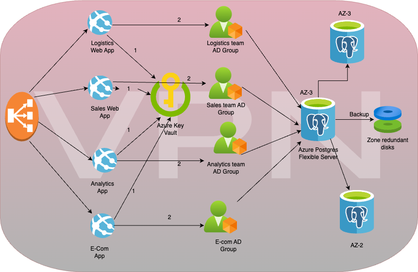

# System Design - 1

The proposed architecture for accessing the database would be as follows:

1. The database would be hosted on Azure Database for PostgreSQL-Flexible Server. 
   Azure Database for PostgreSQL - Flexible Server is a fully managed database service designed to provide more granular control and flexibility over database management functions and configuration settings.
   The reasons for choosing Flexible server are:
   1. Application developments requiring better control and customizations.
   2. Zone redundant high availability 
   3. Managed maintenance windows
   4. Encripted zone redundant Automatic backups
   5. Adjust performance and scale within seconds
   6. Enterprise grade security
   7. Monitoring and alerting
   8. Built-in PgBouncer for connection pooling

2. Each team would be assigned a separate Azure Active Directory (AAD) group, and access to the database would be managed using Azure AD authentication and authorization.

   1. Logistics team would be granted read and write access to the sales details table and read-only access to other tables using Azure AD role-based access control (RBAC).
   2. Analytics team would be granted read-only access to all tables using Azure AD RBAC.
   3. Sales team would be granted read and write access to the sales details table and read-write access to the items table using Azure AD RBAC.
3. The database instances and all apps accessing it would be located in an Azure Virtual Private Network (VPN) to ensure network isolation and protection.
   It will also ensure apps to access database in one network hop. reducing network latency thus faster access.
4. Regular backups of the database would be taken using Azure Backup to ensure data can be recovered in case of any system failures.

5. Access to the database would be secured using encrypted connections, such as SSL, and credentials would be stored in Azure Key Vault.

6. Monitoring and logging tools, such as Azure Monitor and log analytics workspace, would be used to track the performance and health of the system.
7. Database will whitelist the allowed IPs which can connect to database. Any new VM or app will need to whitelist its IP before accessing it.
8. Automated vulnerability scan to be part of CI/CD for any code security bug like sql injection or cross site scripting and also for vulnerable libraries scan.
9. Request rate limit from single IP to prevent DDOS attacks.

## Assumptions:

1. The database schema will remain the same for all teams.
2. The teams will only access the database through the provided interface and will not try to connect to database directly.
3. The database instances will be hosted in the same region for optimal performance.
4. The database will support concurrent read and write operations to ensure that multiple teams can access the database simultaneously.
5. Only admins can only whitelist the IPs.
