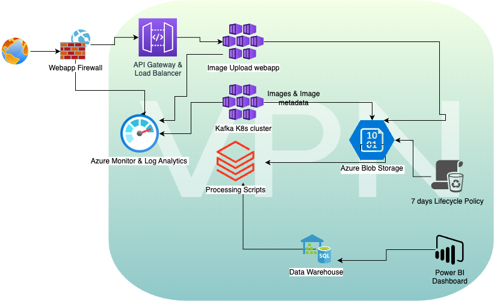

# System Design - 2

The architecture consists of the following components:

## API Gateway: 
This component is responsible for handling incoming API requests to upload images from the web application. The API Gateway sends the request to image webapp, that saves the image & metadata to an Azure Blob storage account. The Blob storage account is configured with a retention policy to delete objects after 7 days to comply with the company's data retention policy.

## Kafka Stream: 
This component is responsible for receiving images from the Kafka stream and processing them. The Kafka stream is managed by the company's engineers and hosted on an Azure Kubernetes Service running Apache Kafka. The processed images & metadata are saved to an Azure Blob storage account.

## Processing Script: 
This component consists of the image processing scripts written by the company's software engineers. These scripts are stored in an Azure Blob storage account and hosted on azure Databricks for the processing that processes images stored in the Blob storage accounts mentioned above.

## Business Intelligence: 
This component allows analysts to perform analytical computations on the image metadata stored in Azure SQL DWH. The analysts can use Power BI to visualize and analyze the data.

## Access and Security: 
The architecture is designed with security in mind to ensure that access to the environment and its resources is secure as the company expands. The API Gateway, Kafka Stream, and Business Intelligence resources are all placed behind an Azure Virtual Network (VNet) that is only accessible through a VPN. All the Blob storage accounts and SQL DWH are encrypted using Azure Key Vault. The Virtual Machine running the Kafka stream and the image webapp running the image processing scripts are placed inside an auto-scaling AKS cluster that ensures high availability and scalability.

## Scaling: 
The architecture is designed to scale to meet user demand while keeping costs low. 
The API Gateway, Kafka Stream,  are all placed behind an Azure Load Balancer that distributes incoming traffic to multiple Virtual Machines running each service. 
The databricks clusters running the image processing scripts are placed inside an auto-scaling cluster that automatically scales up or down based on demand. 
The Blob storage accounts and Azure SQL DWH are designed to handle high traffic and scale automatically.

## Maintenance: 
All are managed services from Azure, easy to manage patching, backup & recovery.

## Assumptions made in this architecture:

1. The company's software engineers have written code that can run on Azure Databricks.
2. The company's engineers are familiar with managing Kafka on Azure Kubernetes Cluster.
3. The company has a VPN  set up to access the VNet.
4. The company has set up Azure Key Vault to manage encryption keys.
Overall, this architecture is designed to address the company's requirements and concerns while also adhering to best practices in cloud computing, including scalability, high availability, and security.
